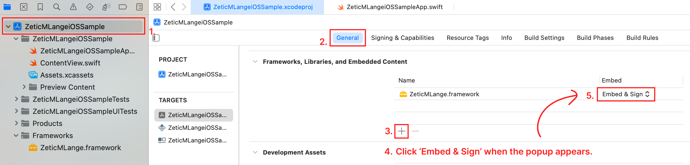
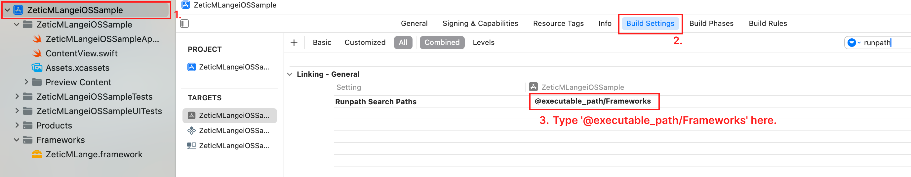

# Zetic MLange iOS Sample App

Deploy to XCode
========================

 Currently Swift Native Interface is provided.

## Prerequisite

1. Model file

    - Model file is provided by ZETIC.ai with REST API. You can simply use the API with model key.

2. .framework Library

    - Zetic MLange : [`ZeticMLange.framework`](https://github.com/zetic-ai/zetic_mlange_ios_sample)

## iOS application project structure

``` 
ZeticMLangeiOSSample
└── ZeticMLange.framework
└── ZeticMLangeiOSSample
        └── ZeticMLangeiOSSampleApp.swift
```

## App settings

1. Embed the framework


2. Set Runpath Search Paths to `@executable_path/Frameworks`


## Application Implementation


1. Zetic MLange model running (Swift)

``` swift
// 1. Zetic MLange model running

// (1) Prepare model inputs
let inputs: [Data] = [] // Prepare your inputs

// (2) Load Zetic MLange model
let model = try ZeticMLangeModel("MLANGE MODEL KEY")

// (3) Run model and get outputs
try model.run(inputs)

// (4) Get output data array
let outputs = model.getOutputDataArray()
```
